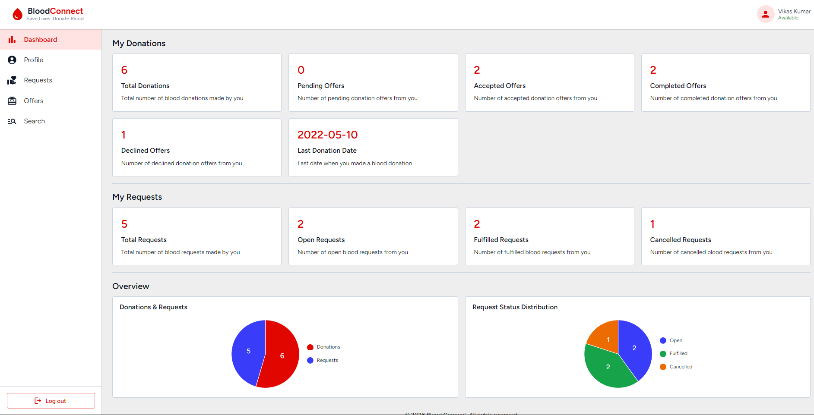
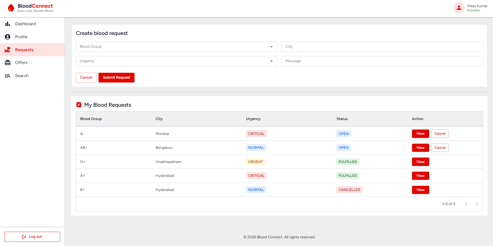

# Blood Connect

Blood Connect is a full-stack blood donation management platform built with a React frontend and a Spring Boot backend. The application matches blood requests with available donor offers, manages the request-to-donation lifecycle, and provides real-time activity metrics through a dedicated dashboard.

[**Live Demo**](https://your-demo-link.com) | [**Live Backend**](https://blood-connect-api-dvlk.onrender.com/)

---

## 1. Project Screenshots & Media

|                **Dashboard & Stats**                |                        **Requests**                        |
| :-------------------------------------------------: | :------------------------------------------------------: |
|  |  |

---

## 2. Demo Credentials

You can test the application directly using the following credentials:

- **Email:** `vikas.kumar@gmail.com`
- **Password:** `000000`

---

## 3. Tech Stack

- **Frontend:** React 18, React Router v6, Material UI (MUI), Vite, Axios
- **Backend:** Java, Spring Boot
- **Architecture:** Flat Minimalist UI Design, RESTful APIs, JWT Authentication

---

## 4. Key Features

- **User Authentication:** Secure registration and login flows with JWT token handling.
- **Blood Request Management:** Allows users to create, view, and track blood requests.
- **Donor Matching Workflow:** Integrates with the backend matching engine to pair requests with available donors.
- **Interactive Offer Lifecycle:** Donors can accept, complete, or decline matched requests.
- **Activity Stats Dashboard:** Provides visual insights into completed donations and pending requests.
- **User Search:** Enables users to search profiles by name and view public activity.

---

## 5. Project Technical Overview & Architecture

### 1. Core Technical Highlights

- **State & Performance Optimization:** Migrated complex form state to **React Hook Form** using uncontrolled inputs (`ref`s), completely eliminating per-keystroke component re-renders. Applied `React.memo`, `useCallback`, and `useMemo` across heavy presentation components to isolate render trees strictly to prop updates.
- **API & Security Architecture:** Engineered a centralized **Axios** configuration with automated interceptors to inject JWT bearer tokens on outgoing requests and process global `401/403` auth fallbacks in a single layer.
- **Global Error Management:** Implemented a custom centralized error-handling utility function, converting raw `4xx/5xx` HTTP failures and network drops into uniform UI notifications across all routes.
- **Design System & UI Components:** Built an accessible, responsive UI using **Material UI (MUI)** and Flat Design principles, eliminating CSS to enforce consistent layout grids, typography, and component reusability.
- **Environment Configuration:** Maintained strict build isolation between `development` and `production` environments using dynamic environment variables for API endpoints and environment flags.

---

### 2. Technical Challenges & Engineering Solutions

### Challenge 1: Unnecessary Re-renders in Complex Forms

- **Problem:** State-bound form inputs triggered full-component re-renders on every keystroke, introducing input lag on low-power client devices.
- **Solution:** Replaced React `useState` forms with `React Hook Form` (`ref`-based pattern), deferring value evaluation to submit/validation phases and reducing per-input render cycles to zero.

### Challenge 2: Redundant Error-Handling Logic

- **Problem:** Duplicated try/catch blocks across individual page components created inconsistent error UI feedback and high code duplication.
- **Solution:** Unified network error catching via a custom utility function, handling server downtimes, invalid payloads, and connection loss through a single global handler.

### Challenge 3: Merge Conflicts & Codebase Overlaps

- **Problem:** Concurrent feature development on shared UI files caused frequent merge conflicts in core component modules.
- **Solution:** Decoupled shared UI into modular, single-responsibility components and enforced strict feature-branching workflows with atomic commit hygiene.

---

## 6. Local Setup Instructions

### Prerequisites

- **Node.js:** v18 or newer
- **npm:** v9 or newer

### Installation & Quick Start

1. **Clone the repository:**
   ```bash
   git clone https://github.com/udayraj10/bloodconnect.git
   cd bloodconnect
   ```
2. **Install dependencies:**
   ```
   npm install
   ```
3. **Configure environment variables:**

   Create a .env file in the project root:

   ```
   VITE_API_BASE_URL=https://blood-connect-api-dvlk.onrender.com/
   ```

4. **Start the development server:**
   ```
   npm run dev
   ```

## License

This project is open-source software licensed under the MIT License.
